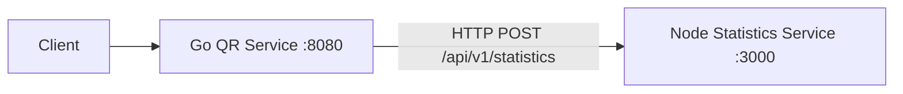
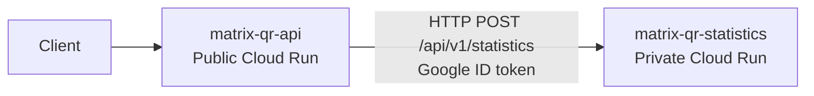

# Architecture

## Overview

Matrix QR Analytics is implemented as two backend services with synchronous HTTP communication.

```text
Client
  |
  v
Go QR Service
  |
  | HTTP POST /api/v1/statistics
  v
Node Statistics Service
```

Normal client traffic goes through `POST /api/v1/qr` on the Go QR Service.

The Go QR Service is the public facade and orchestrator.
The Node Statistics Service is an internal specialized service.
In local Docker Compose both services are reachable on localhost for development/debugging, but the Node service remains conceptually internal.

## Environment Topologies

### Local topology (Docker Compose)



Characteristics:

- `docker-compose.yml` orchestrates both services.
- Service-to-service routing uses Compose networking.
- Local mode typically uses `STATISTICS_AUTH_MODE=none`.

### Cloud topology (Google Cloud)



Characteristics:

- Both backend services run on Cloud Run in `southamerica-west1`.
- Go service `matrix-qr-api` is public.
- Node service `matrix-qr-statistics` is private.
- Go calls Node with `STATISTICS_AUTH_MODE=google-id-token`.
- The ID token audience is the Node service base URL.
- Go runtime identity has Cloud Run invoker permission on the private Node service.

## Service Responsibilities

### Go QR Service

Technology: Go 1.24+, Fiber, Gonum.

Responsibilities:

- Public HTTP entry point for client requests.
- Matrix payload validation and request error mapping.
- QR decomposition for rectangular numeric matrices.
- Downstream call to the Statistics Service.
- Response aggregation (`q`, `r`, and `statistics`).

### Node Statistics Service

Technology: Node.js 22+, TypeScript, Express 4.x.

Responsibilities:

- Validation of `q` and `r` matrices.
- Computation of aggregate statistics across `q` and `r`.
- Response of statistics contract consumed by the Go service.

## Runtime Structure

### Go runtime structure

- `cmd/server`: process bootstrap, config load, dependency wiring, Fiber startup.
- `configs`: environment-driven runtime settings (port, statistics URL, timeout).
- `internal/handlers`: HTTP routes and transport-layer error/status mapping.
- `internal/services`: matrix validation and QR/orchestration service logic.
- `internal/clients`: HTTP client for Statistics Service with downstream response validation.
- `internal/models`: request/response and error envelope models.

### Node runtime structure

- `src/app.ts`: application factory (`createApp`) that assembles middleware/routes without binding a socket.
- `src/index.ts`: process bootstrap (`dotenv` load + `app.listen`).
- `src/controllers`: HTTP controller mapping request/response to service calls.
- `src/routes`: Express route registration.
- `src/services`: matrix validation and statistics calculation logic.
- `src/errors`: domain validation error type.
- `src/types.ts`: TypeScript matrix/statistics types.
- `config/`: runtime configuration values.
- `test-support/`: integration-test bootstrap for running compiled Node service from Go integration tests.

TypeScript source is compiled by `tsc` into `dist`, and runtime execution uses compiled JavaScript (`node dist/src/index.js`).

## QR Decomposition Contract

For input matrix `A` with shape `m x n`:

- `Q` shape is `m x m`.
- `R` shape is `m x n`.
- Supported inputs include square (`m = n`), tall (`m > n`), and wide (`m < n`) matrices.

Numerical invariants:

- `A ~= Q * R`
- `Q^T * Q ~= I`
- `R` is upper trapezoidal

Implementation note:
the Go QR service uses Gonum LAPACK-backed operations (`Geqrf` and `Orgqr`) to generate full-shape outputs for general rectangular inputs accepted by the public API. This avoids older high-level shape restrictions from earlier QR approaches.

## Communication and Failure Boundaries

Communication model:

- Synchronous HTTP from Go to Node.
- No persistence layer.
- No queue.
- No retry mechanism.

The Go Statistics client uses a configured timeout and treats transport failures, non-200 responses, malformed JSON, and incomplete downstream success payloads as statistics unavailability.

Architectural error mapping:

- Malformed request body -> `400`.
- Invalid matrix payload -> `400`.
- Statistics Service unavailable or invalid downstream contract -> `502`.
- Unexpected internal failure -> generic `500`.

## Statistics Semantics at Service Boundary

The Node Statistics Service receives `q` and `r` matrices and computes:

- `max`
- `min`
- `sum`
- `average`
- `hasDiagonalMatrix`

Semantics:

- Values are aggregated across all cells from both `q` and `r`.
- `average = sum / total cell count across q and r`.
- `hasDiagonalMatrix` is true when `q` OR `r` is diagonal.
- Diagonal checks require square shape and treat off-diagonal `|value| <= 1e-10` as zero.

## Deployment Model

Each service is packaged as its own Docker image.

Local container deployment:

- `docker-compose.yml` runs both services on a shared bridge network.
- Local ports are exposed for development.
- Go reaches Node via Compose service hostname (`http://statistics-service-node:3000`).

Cloud deployment:

- Artifact Registry repository `matrix-qr` stores both service images.
- Cloud Build CI pipeline: `cloudbuild/ci.yaml`.
- Cloud Build CD pipeline: `cloudbuild/deploy.yaml`.
- CD deploys private Node first, resolves Node Cloud Run URL dynamically, then deploys public Go with cloud auth env configuration.
- Runtime identities are dedicated per service account for Go and Node services.

Compose startup dependency uses Node health status (`depends_on` with `service_healthy`) before Go starts.

No Kubernetes deployment is part of the current implementation architecture.

## Testability Characteristics

The architecture includes explicit testability seams:

- Go QR service depends on a `StatisticsClient` abstraction.
- Node app assembly is separated into `createApp` (factory) and `index.ts` (process bootstrap).
- Go integration bootstrap can start the compiled Node service independently through `test-support/start-test-server.js`.

## Documentation Artifacts

- `docs/openapi.yaml` is the API contract source of truth.
- `docs/api-reference.html` renders that contract through Scalar.
- `postman/Matrix-QR-Analytics.postman_collection.json` is a curated manual/API testing collection.
